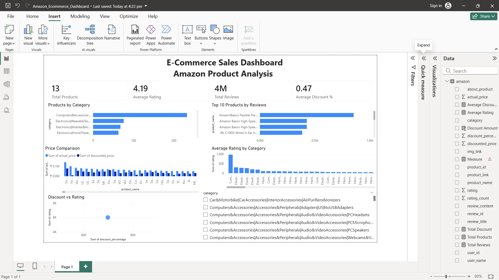

# ecommerce-powerbi-dashboard
E-commerce sales dashboard using Power BI

## Project Overview
This project analyzes Amazon product data using Power BI to identify product trends, ratings, and pricing insights.

## Tools Used
Power BI
Power Query
DAX

## Dashboard Insights
- Total Products
- Average Rating
- Top Products by Reviews
- Price Comparison
- Discount vs Rating Analysis

## Files Included
- Power BI Dashboard (.pbix)
- Dataset (.csv)

## Dashboard Preview

